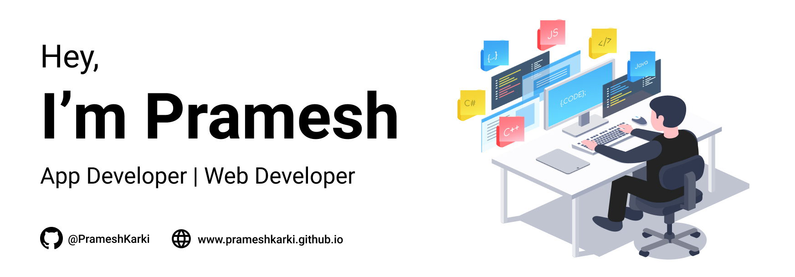

<!--
**PrameshKarki/PrameshKarki** is a ✨ _special_ ✨ repository because its `README.md` (this file) appears on your GitHub profile.

Here are some ideas to get you started:

- 🔭 I’m currently working on ...
- 🌱 I’m currently learning ...
- 👯 I’m looking to collaborate on ...
- 🤔 I’m looking for help with ...
- 💬 Ask me about ...
- 📫 How to reach me: ...
- 😄 Pronouns: ...
- ⚡ Fun fact: ...
-->

### About Me:
I am a passionate self taught web/app developer👨‍💻 from land of Mount Everest,Nepal.I tend to make use of modern web/app technologies to build websites/apps that looks great,feels fantastic and functions correctly. My goal is to always build products that provide pixel perfect,performant experiences.I love creating open-source projects and contributing to the community.

### Stats: 

### 📫 How to reach me:

- Email : Parameswarkarki@gmail.com
- Twitter : [@PrameshKarki07](https://twitter.com/PrameshKarki07)
- Portfolio : [prameshkarki.github.io](https://prameshkarki.github.io/) 
